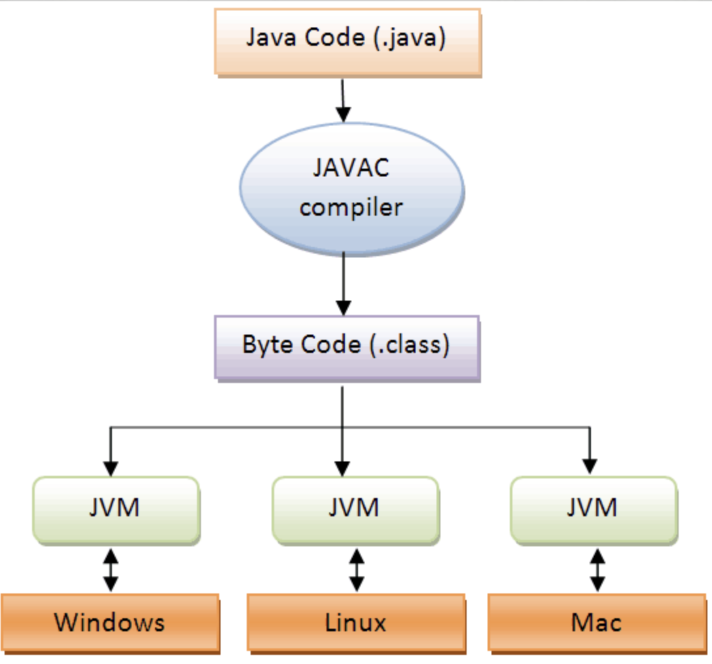

# JVM 

- JVM은 Java Virtual Machine의 약자로 , 자바 가상 머신이라고 부른다.

- 자바와 운영체제 사이에서 중개자 역할을 수행하며 , 자바가 운영체제에 구애 받지 않고 프로그램을 실행할 수 있도록 도와준다.

- 가비지 컬렉터를 사용한 메모리 관리도 자동으로 수행하며 , 다른 하드웨어와 다르게 레지스터 기반이 아닌 스택 기반으로 동작한다.

- JVM은 자바 언어에서만 사용하는 것이 아니라 코틀린 , 스칼라 언어에서도 JVM동작 방식을 그래도 따른다.

 

### JVM을 정확히 이해하면 추후에 자바에서 파생된 모던 언어를 이해하는데 있어 수월해지며, 내부에서 정확히 어떻게 동작을 해서 코드가 실행되는지 알면 코드 최적화나 리팩토링을 하는데 매우 도움이 된다.

 

##### 실행 단계

 

1. 자바 컴파일러에 의해 자바 소스 파일은 바이트 코드로 변환된다.
2. 변환된 바이트 코드를 JVM에서 읽어 들인다.
3. 자바 소스 파일은 어떤 운영체제에서든 실행이가능하다. 단 해당 운영체제의 전용 JVM이 필요하다.

# JVM 메모리 구조

JVM이 정확히 어떻게 동작하는지에 대해

자바 소스 파일은 자바 컴파일러에 의해 바이트 코드 형태인 클래스파일이됨. 이 파일을 JVM이 수행

## Class Loader

- JVM내로 클래스 파일을 로드하고 , 링크를 통해 배치하는 작업을 수행하는 모듈.

- 런타임 시에 동적으로 클래스를 로드한다.

 
 

## Execution Engine

- 클래스 로더를 통해 JVM 내의 Runtime Data Area에 배치된 바이트 코드들을 명령어 단위로 읽어서 실행한다.

- 최초 JVM이 나왔을 당시에는 인터프리터 방식이었기 때문에 속도가 느리다는 단점이 있었지만 JIT컴파일러 방식을 통해 이 점을 보완하였다.

- JIT는 바이트 코드를 어셈블러 같은 네이티브 코드로 바꿈으로써 실행이 빠르지만 역시 변환하는데 비용이 발생한다.
그러므로 <i><b>JVM은 모든 코드를 JIT컴파일러 방식으로 실행하지 않고 , 인터프리터 방식으로 사용하다가 일정한 기준이 넘어가면 JIT컴파일러 방식으로 실행한다.</b></i>

 
 

## Garbage Collector

- Garbage Collector(GC)는 <i><b>힙 메로리 영역에 생성된 객체들 중에서 참조되지 않은 객체들을 탐색 후 제거하는 역할을 한다.</i></b>

- GC가 역할을 하는 시간은 언제인지 정확히 알 수 없다.

 
 

## Runtime Data Area

- JVM의 메모리 영역으로 자바 애플리케이션을 실행할 때 사용되는 데이터들을 적재하는 영역이다.

- Runtime Data Area영역에는 <b>Method Area</b> , <b>Heap Area</b> , <b>Stack Area</b> , <b>PC Register</b> , <b>Native Method Stack</b>로 나눠진다.

 
 

# RuntimeDataArea 구조 

- Method area
    
    모든 쓰레드가 공유하는 메모리 영역이다. 메소드 영역은 클래스 , 인터페이스 , 메소드 , 필드 , Static 변수 등의 바이트 코드를 보관한다.

 
 

- Heap area

    모든 쓰레드가 공유하며, new 키워드로 생성된 객체와 배열이 생성되는 영역이다. 메소드 영역에 로드된 클래스만 생성이 가능하고 , Garbage Collector가 참조되지 않는 메모리를 확인하고 제거하는 영역이다.

 
 

- Stack area

    
    메서드 호출 시마다 각각의 스택 프레임이 생성된다. 그리고 그 메서드 안에서 사용되는 값들을 저장하고 , 호출된 메서드의 매개변수 , 지역변수 , 리턴 값 및 연산 시 일어나는 값들을 임시로 정장한다. 마지막으로 수행이 끝나면 프레임별로 삭제된다.

 
 

- PC Register

    쓰레드가 시작될 때 생성되며 , 생성될 때마다 생성되는 공간으로 쓰레드마다 하나씩 존재한다. 쓰레드가 어떤 부분을 무슨 명령으로 실행해야할 지에 대한 기록을 하는 부분으로 현재 수행중인 JVM명령의 주소를 갖습니다.

 
 

- Native method stack

    자바 외 언어로 작성된 네이티브 코드를 위한 메모리 영역이다.

 
 
 
 
 
참고한 블로그 : https://steady-coding.tistory.com/305 , https://inpa.tistory.com/entry/JAVA-%E2%98%95-JVM-%EB%82%B4%EB%B6%80-%EA%B5%AC%EC%A1%B0-%EB%A9%94%EB%AA%A8%EB%A6%AC-%EC%98%81%EC%97%AD-%EC%8B%AC%ED%99%94%ED%8E%B8