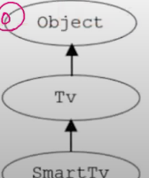

# 단일 상속

Java는 단일 상속만을 허용한다.(C++은 다중상속 허용)

다중상속의 장점도 있지만 단점도 있기때문에 JAVA에서는 단일 상속만을 허용한다.

다중상속에는 충돌의 문제점이있다. 상속->상속->상속 될수록 충돌의 위험성은 더욱 커진다.  

 

### 다중상속처럼 편리하게 만들기
- 비중이 높은 클래스 하나만 상속관계로 가져가고 , 나머지는 포함관계로 한다.

 
 
 

# Object클래스 - 모든 클래스의 조상
- 부모가 없는 클래스는 자동적으로 Object클래스를 상속받게 된다.

 

    class Tv{
        // 부모가없는 클래스 
    }

    ⬇︎⬇︎ 부모가 없는 클래스는 컴파일러가 자동으로 Object클래스를 상속시킴

    class Tv extends Object{

    }

그러므로 모든 클래스는 Object클래스에 정의된 11개의 메서드를 상속받는다.
toString() , equals(Object obj) , hashCode(),... 등등

 

모든 상속계층에는 맨위 최고조상에 무조건 Object클래스가 있다.

