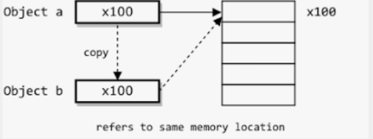

# Shallow copy VS Deep copy

Shallow copy(얕은복사) : 주소값을 복사하게된다. 즉 복사된 변수와 같은 주소를 가르키게된다.
Deep copy(깊은복사) : 실제값을 새로운 메모리에 복사한다. 즉 실제데이터만 복사된다.

 
 

# 얕은복사 EX)

    class Data{
        int a = 10; 
        int b = 20;
    }
Data라는 클래스를 만들어주었다. 

    public static void main(String[] args){
        Data data1 = new Data();
        System.out.println(data1.a);   // 출력 : 10
    }

  

Data를 인스턴스해주었다. data1.a는 10이다. 

이제 복사를 해보겠다. 

        public static void main(String[] args){
            Data data1 = new Data();

            Data copyData = data1;

            System.out.println("data1.a의 값 : "  + data1.a);

            copyData.a = 50;  // data1을 복사한객체를 참조하여 값을 바꿈.

            System.out.println("data1.a의 값 : "  + data1.a);  // 복사된 객체를 바꾸었지만 data1도 바뀌는현상
    }

출력 

    data1.a의 값 : 10
    data1.a의 값 : 50

 

출력값을 보면 data1 객체의 값는 바꾸지 않았지만 복사된 copyData를 바꾸면 같이 바뀌는 현상을 볼 수 있다. 

 

그 이유는 주소값이 들어있기 때문이다. 즉 복사된 참조변수에 복사할려는 객체의 주소값이 들어있기 때문에 동일한 주소값이 복사되어 같은 값을 가르키게 되었다. 

 

이 그림처럼 동일한 데이터를 가르킨다.

 

이렇게 우리가 원하지 않는 데이터를 수정할 수 있는 일이 생길 수 있기때문에
복사를 할때는 신중하게 생각하고 해야한다.

실제데이터만을 복사를 할려면 깊은복사를 해야한다.

 
 

# 깊은복사

깊은 복사를 구현하는 방법들 

 

- 복사 생성자 
- 복사 팩터리
- Cloneable Interface

 
 

***

## 복사 생성자

    public class Copy {
        public static void main(String[] args){
            Data data = new Data();
            data.a = 10;
            data.b = 20;

            //복사 생성자로 복사하기
            Data copyData = new Data(data);
            copyData.a = 100;
            copyData.b = 150;

            System.out.printf("data.a : %d , data.b : %d \n" , data.a , data.b);
            System.out.printf("copyData.a : %d , copyData.b : %d \n" , copyData.a , copyData.b);
        }
    }

 

Data클래스 

    class Data{
        int a;
        int b;

        public Data(){

        }

        // 복사 생성자
        public Data(Data copyData){
            // 넘어온 copyData를 참조하여 값을대입
            this.a = copyData.a;
            this.b = copyData.b;
        }
    }

클래스의 생성자를 만들어서 넘어온 객체의 프로퍼티를 모두 복사해준다.

 
출력값

    data.a : 10 , data.b : 20 
    copyData.a : 100 , copyData.b : 150

깊은 복사를 하면 새로운 메모리에 데이터가 삽입되기 때문에 참조변수의 주소값이 다르다.

 
 

***

## 복사 팩터리

    public class Copy {
        public static void main(String[] args){
            Data data = new Data();
            data.a = 30;
            data.b = 40;

            Data copyData = Data.copy(data);

            System.out.printf("copyData.a : %d , copyData.b : %d\n" , copyData.a , copyData.b);

            System.out.println("copyData 값 수정");
            copyData.a = 120;
            copyData.b = 150;

            System.out.printf("data.a : %d , data.b : %d\n" , data.a , data.b);
            System.out.printf("copyData.a : %d , copyData.b : %d\n" , copyData.a , copyData.b);
        }
    }

 

복사 팩터리 static메서드 생성

    class Data{
        int a;
        int b;

        public static Data copy(Data copyData){
            Data data = new Data();
            data.a = copyData.a;
            data.b = copyData.b;
            return data;
        }
    }

1 - Data클래스의 static메서드를 만들어준다. 

2 - 새로운 객체를 생성하여 파라미터로 넘어온 copyData를 참조하여 모든 파라미터를 복사해준다.

3 - 데이터가 복사된 객체를 return해준다.

 
 

출력

    copyData.a : 30 , copyData.b : 40
    copyData 값 수정
    data.a : 30 , data.b : 40
    copyData.a : 120 , copyData.b : 150

 
 

***

## Cloneable interface구현

 

Cloneable interface 주의점 : 

Cloneable 인터페이스는 복제해도 되는 클래스임을 명시하는 용도의 믹스인 인터페이스지만, 아쉽게도 의도한 목적을 제대로 이루지 못했다. 여기서 큰 문제점은 clone 메서드가 선언된 곳이 Cloneable이 아닌 OBject이고, 그 마저도 protected이다. 그래서 Cloneable을 구현하는 것만으로는 외부 객체에서 clone 메소드를 호출할 수 없다. 리플렉션을 사용하면 가능하지만, 100% 성공하는 것도 아니다. 

이러한 여러 문제점을 가진 인터페이스이지만, Cloneable 방식은 널리 쓰이고 있어서 잘 알아두는 것이 좋다.

Cloneable이 몰고 온 모든 문제를 되짚어봤을 때, 새로운 인터페이스를 만들 때는 절대 Cloneable을 확장해서는 안 되며, 새로운 클래스도 이를 구현해서는 안된다. final 클래스라면 Cloneable을 구현해도 위험이 크지는 않지만, 성능 최적화 관점에서 검토한 후 별다른 문제가 없을 때만 드물게 허용해야 한다.

### <b> 기본 원칙은 '복제 기능은 생성자와 팩터리를 이용하는게 최고' 라는 것이다. </b>

단, 배열만은 clone 메소드 방식이 가장 깔끔한, 이 규칙의 합당한 예외라 할 수 있다.

 

    public class Copy {
        public static void main(String[] args) throws CloneNotSupportedException {

            Data data = new Data();
            data.a = 15;
            data.b = 30;

            Data copyData = data.clone();

            System.out.printf("data.a : %d , data.b : %d \n" , data.a , data.b);
            System.out.printf("copyData.a : %d , copyData.b : %d \n" , copyData.a , copyData.b);

            System.out.println("copyData 값 수정");
            copyData.a = 120;
            copyData.b = 150;

            System.out.printf("data.a : %d , data.b : %d\n" , data.a , data.b);
            System.out.printf("copyData.a : %d , copyData.b : %d\n" , copyData.a , copyData.b);

        }
    }

 

Cloneable interface 상속

    class Data implements Cloneable{
        int a;
        int b;

        // clone() 메소드 구현
        public Data clone() throws CloneNotSupportedException{
            return (Data) super.clone();
        }
    }

 

출력

    data.a : 15 , data.b : 30 
    copyData.a : 15 , copyData.b : 30 
    copyData 값 수정
    data.a : 15 , data.b : 30
    copyData.a : 120 , copyData.b : 150

 

### Cloneable interface주석 
 

- 클래스는 Cloneable 인터페이스를 구현하여 Object.clone() 메서드에 해당 메서드가 해당 클래스 인스턴스의 필드 간 복사본을 만드는 것이 적법함을 나타냅니다.
Cloneable 인터페이스를 구현하지 않는 인스턴스에서 객체의 복제 메서드를 호출하면 CloneNotSupportedException 예외가 발생합니다.
규칙에 따라 이 인터페이스를 구현하는 클래스는 공용 메서드로 <b> Object.clone(보호됨)을 재정의해야 합니다. </b> 이 메서드 재정의에 대한 자세한 내용은 Object.clone()을 참조하십시오.
이 인터페이스에는 복제 방법이 포함되어 있지 않습니다. 따라서 이 인터페이스를 구현한다는 사실만으로는 개체를 복제할 수 없습니다. 복제 메소드가 반영적으로 호출되더라도 성공한다는 보장은 없습니다.