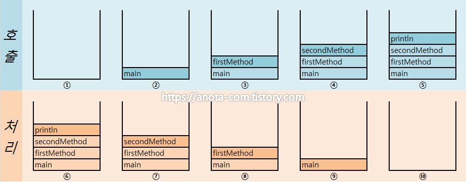

# CallStack
호출 스택이란?

- 메소드가 호출되면 필요한 메모리를 스택에서 할당받게된다. 
- 메소드가 종료되면 사용했던 메모리는 반환된다.
- 호출 스택의 맨 위에 있는 메소드가 현재 실행중인 메소드가 되고 , 밑에 나머지는 대기하게된다. 
- 아래에 있는 메소드가 바로 위의 메소드를 호출한 메소드이다.

 

이 그림을 보면 이해가 쉬울거다. 

 

호출 
1. 맨처음 main메소드가 실행됬다. 
2. main메소드에서 firstMethod를 호출한다.
3. firstMethod에서 secondMethod를 호출한다.
4. secondMethod에서 println을 호출한다.

 

처리

1. 맨위에있는 println을 처리한다. 다 처리가되면 메모리는 반환된다.
2. 대기상태중이던 secondMethod가 실행상태로된다. 종료되었다면 메모리는 반환된다.
3. firstMethod가 실행상태도 된다. 종료가되었다면 메모리가 반환된다.
4. main메소드가 실행상태가된다. 호출할 메소드가 없다면 메모리가 반환되고 프로그램이 종료된다.

