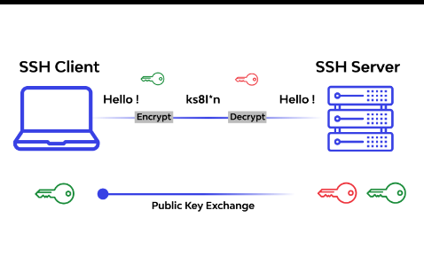

# SSH

- SSH는 Secure Shell의 줄임말이다.
- 원격 호스트에 접속하기 위해 사용되는 보안 프로토콜이다.
- 기본 포트는 22번 이다.

 

    기존 원격 접속은 텔넷이라는 방식으로 사용했지만 암호화를 제공하지 않기 때문에 보안상 취약하다. WireShark같은 프로그램으로 원격접속과정에서 옮겨지는 비밀번호가 노출될 수 있다. 때문에 암호화하는 SSH가 등장했다. 현재 원격 접속 보안을 위한 필수적인 요소라 할 수 있다.

 

## 동작하는 방식

 

SSH 키는 공개키(public key)와 비공개키(private key)로 이루어져있다. 
이 두개의 관계를 이해하는 것이 SSH Key를 이해하는데 핵심이다. 
키를 생성하는 방식이 두 가지가 있는데 , 그것이 SSH의 '대칭키' 와 '비대칭키' 방식이다.

 
 
 

- # 비대칭키 방식
     
    - 가장 먼저 사용자와 서버가 서로의 정체를 증명해야 한다. 이 시점에서 사용되는 것이 비대칭키 방식이다. 비대칭키 방식에서는 서버 또는 사용자가 Key Pair를 생성한다. 키 페어는 공개 키와 개인 키의 두가지로 이루어진 한 쌍을 뜻하며 , <a>보통 공개키의 경우 .pub </a>, <a>개인 키의 경우 .pem</a>의 파일 형식을 띄고 있다.

     

    - 사용자가 키 페어를 생성했을 경우 , 공개 키를 서버에 전송한다. 공개 키는 말그대로 '공개'된 키이기 때문에 누구나 가질 수 있다. 떄문에 전송과정에서 유출되어도 크게 문제가 되지 않는다. 서버는 공개키를 받아서 이 공개 키로 만들어진 랜덤한 값을 생성한다. 이 값은 사용자가 올바른 키페어를 가지고 있는지 시험하는 일이다.

     

    - 개인키는 공개키와 달리 어디에도 보여주지 않는 소중한 파일이다. 그래서 결과적으로 개인키가 서버와 사용자 간의 사이를 증명하는 수단이된다. 공개 키에서 나온 문제는 개인 키로만 풀 수 있고 , 개인 키는 사용자만 가지고있다. 그동안 CLOUD를 이용하면 받았는 pem파일이 바로 이 파일이다. 

     

    - 서버는 사용자로부터 전송받은 값을 자신이 처음에 낸 값과 비교한다. 두 값이 같다면 서버는 공개키에 대응하는 키가 내가 가지고있는 키가 맞다고 판단되면 접속을 허용한다. 이렇게 최초 접속 시 사용자와 서버 간의 인증 절차가 비대칭키 방식을 통해 완료된다.

   

- # 대칭키식방식

    - 서로가 누군지를 알았으니 이제 정보를 주고받을 차례다. 주고받는 과정에서 정보가 새어나가지 않기 위해 정보를 암호화해서 주고받는데 여기서 사용되는 과정이 대칭키 방식이다. 대칭키 방식에서는 비대칭키 방식과 달리 한개의 키만을 사용하는데 이것을 대칭키 라고 한다.

    - 사용자또는 서버는 하나의 대칭키를 만들어 서로 공유한다. 공유된 대칭 키를 이용해 정보를 암호화하면, 받은 쪽에서 동일한 대칭 키로 암호를 풀어 정보를 습득하게된다. 정보 교환이 완료되면 교환 당시 썼던 대칭 키는 폐기되고 , 나중에 다시 접속할 때마다 새로운 대칭키를 생성하여 사용한다.

 
 

