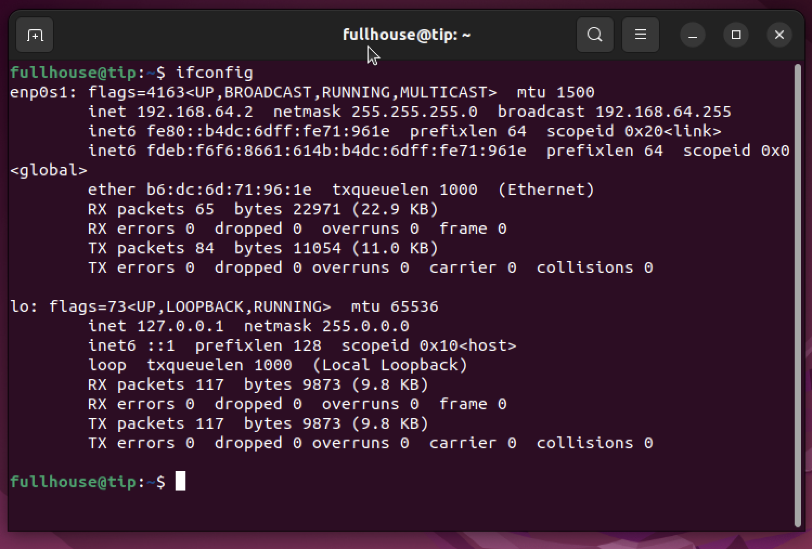
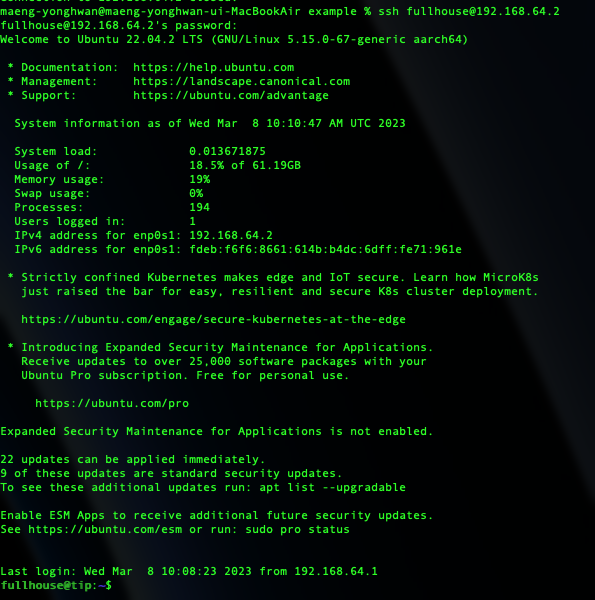
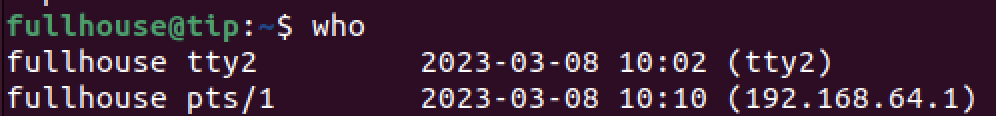

# 가상머신 우분투에 접속하기

UTM으로 우분투를 설치

https://velog.io/@dragon9265/Ubuntu-%EC%84%A4%EC%B9%98-%EB%B0%8F-%EC%85%8B%ED%8C%85with-UTM

 

접속하기 위해선 우분투이름과 ip주소가 필요하다.

ip는 192.168.64.2 

이제 나의 Mac으로 돌아오자. 

    ssh fullhouse@192.168.64.2
터미널에 입력

    터미널 
    fullhouse@192.168.64.2's password:

터미널에서 패스워드를 입력하라고 나온다. 우분투 패스워드를 입력한다.

 
 

접속 성공이다. 

이제 다시 우분투에서 나의 서버에 누가 들어왔는지 확인해보자.

    who명령어를 통해 확인할 수 있다.

 

현재 192.168.64.1이 접속되어있는걸 확인할 수 있다.