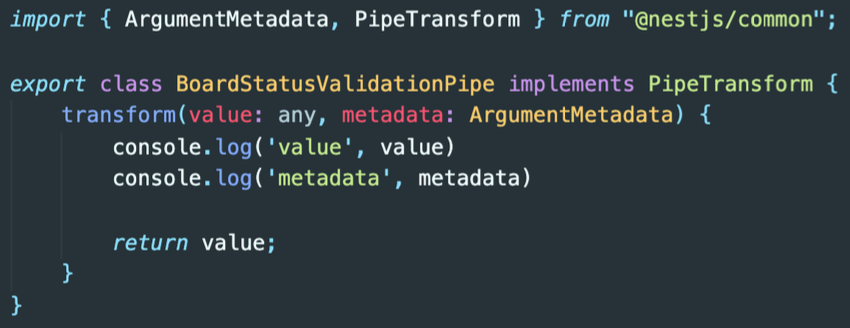

# Custom PIPE

파이프를 직접 구현해보자. 

- 먼저 커스텀 파이프를 구현하기 위해 PipeTransform인터페이스를 상속해주어야한다.

- PipeTransform 인터페이스는 사용할려는 모든 파이프에서 구현되어야한다. 

- 모든 파이프는 transform()메소드를 정의 해야한다. NestJS가 인자를 처리하기 위해서 사용된다.

 

 

먼저 파이프로 사용할 폴더를 만들고 파일을 만들어 주었다. 

 

1. 커스텀파이프 클래스를 만들고 PipeTransform인터페이스를 상속해주었다.

2. transform메소드를 만들었다. 두개의 파라미터(value:'클라이언트에서 오는 값' , metadata : 'vlaue의 메타데이터들')를 가지는데 어떤 값이 나오는지 출력해보겠다.

3. <b>transform()메소드에서 return된 값은 Route 핸들러로 전해진다. 만약 여기서 예외가 발생한다면 클라이언트로 바로 응답된다.</b>

 

컨트롤러를 보면 http요청 body안에 status라는 값이 온다는걸 알 수 있다. 'status'옆에 내가 만든 커스텀 파이프를 넣어주면 된다.

 
그럼 status값이 파이프로 들어가게된다. pipe에서 처리되어 값이 올바른값인지 확인할 수 있다.
 
 

value와 metadata의 출력이다. vlue는 말그대로 클라이언트에서 온 값이 들어있다.

 
 

이제 value값을 가지고 해당값이 제대로된 값인지 확인하는 코드만 구현한다면 pipe완성이다. 

    export class BoardStatusValidationPipe implements PipeTransform{
        readonly BoardOptions = [
            BoardStatus.PUBLIC,
            BoardStatus.PRIVATE
        ]
        transform(value: any, metadata: ArgumentMetadata) {
            console.log(value);   //? 클라이언트에서 보낸 값
            console.log(metadata);  //? 인자에 대한 메타데이터 { metatype: [Function: String], type: 'body', data: 'status' } 메타데이터 예시

            value = value.toUpperCase();  //? 대소문자 구별X

            if(this.isStatusValid(value)){
                throw new BadRequestException({status : false , msg : `${value} isn't in the status Options`}); //? 에러 객체던짐
            }

            return value; //? value가 제대로된 값이라면 return
        }

        isStatusValid(value : any) : boolean{
            const index = this.BoardOptions.indexOf(value);
            return index === -1; //? 해당 index가 -1 이면 잘못온거임.
        }
    }
강의내용을 참고했다.