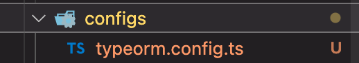

# TypeORM 

*Type Object Relational Mapping*

 

- TypeORM은 node.js에서 실행되고 TypeScript로 작성된 객체 관계형 매퍼 라이브러리이다.
 

- TypeORM은 MySQL , PostgreSQL , MariaDB , SQLite , MS SQL Server , Oracle , SAP Hana 및 WebSQL과 같은 여러 데이터베이스를 지원한다.

 
 

# ORM

*Object Relational Mapping*

 

- 객체와 관계형 데이터베이스의 데이터를 자동으로 변형 및 연결하는 작업이다.
 

- ORM을 이용한 개발은 객체와 데이터베이스의 변형에 유연하게 사용 할 수 있다.

 
 

# Object객체   <- 매핑 ->   관계형 DataBase
 객체지향 프로그래밍은 클래스사용   <->   관계형 데이터베이스는 테이블 사용

 
 

# EX)

 

typeORM

    const boards = Board.find({ title: 'Hello' , status: 'PUBLIC' });

 

Pure Javascript

    db.query('SELECT * FROM boards WHERE title = "Hello" AND status = "PUBLIC" , (err, result) => {
        if(err) {
        if(err) {
        throw new Error('Error') }
        boards = result.rows; 
    })

 
 

# TypeORM의 특징과 이점

- 모델을 기반으로 데이터베이스 테이블 체계를 자동으로 생성한다.

- 데이터베이스에서 개체를 쉽게 삽입 , 업데이트 및 삭제할 수 있습니다.

- 테이블 간의 매핑 (일대일 , 일대 다 및 다 대다)을 만든다.

- TypeORM은 간단한 코딩으로 ORM 프레임 워크를 사용하기 쉽다.

- TypeORM은 다른 모듈과 쉽게 통합된다.

 
 
 

# TypeORM 사용하기

TypeORM을 사용하기 위해서 설치해야하는 모듈

 

- @nestjs/typeorm
    - NestJS에서 TypeORM을 사용하기 위해 연동시켜주는 모듈이다.

- typeorm
    - TypeORM 모듈

- pg 
    - PostgresSQL 데이터베이스를 사용하기 때문에 Postgres모듈을 다운받는다.

 

    npm install pg typeorm @nestjs/typeorm --save

 

NestJs TypeORM 문서 - https://docs.nestjs.com/techniques/database

 

설치를 다 했다면 typeORM 설정 파일을 만들어주자.

 

 
    *src -> configs폴더생성 -> typeorm.config.ts 생성*

 
 

***

typeorm.config.ts작성 

    import { TypeOrmModuleOptions } from "@nestjs/typeorm";

    export const typeORMconfig : TypeOrmModuleOptions = {
        type : 'postgres',
        host : 'localhost',
        port : 5432,
        username : 'postgres',
        password : 'postgres',
        database : 'board-app',
        entities : [__dirname + '/../**/*.entity.{js,ts}'],
        synchronize : true //? production 모드에서는 false로
    }

눈에 띄는 entities와 synchronize는 뭘까?

- entities는 나중에 생성할 엔티티를 하나씩 넣어 줄 수도 있지만 아래 처럼 작성하면 모든 엔티티를 다 포함할 수 있게된다. 

        { // 엔티티 전부 포함 
        ...
        "entities": ["src/bar/entities/**/*.ts"]
        }

        // 엔티티를 하나씩 추가
        import {User} from "./payment/entity/User";
        import {Post} from "./blog/entity/Post";
        {
        ...
        "entities": [User, Post]
        }

- synchronize : true값을 주면 애플리케이션을 다시 실행할 때 엔티티안에서 수정된 컬럼의 길이 타입 변경값등을 해당 테이블을 DROP한 후 다시 생성해준다. <b>*synchronize true는 production 모드에서는 false로... 그렇지 않을 시 데이터를 잃을수 있다...*</b>

 
 

⬇︎⬇︎⬇︎⬇︎⬇︎⬇︎⬇︎

 

### typeorm.config.ts 셋팅을 다 해줬다면 루드 Module(app.module.ts)에서 import 해주어야된다.

    @Module({
        imports: [TypeOrmModule.forRoot(typeORMconfig),UserModule, TestmoduleModule, BoardModule],
        controllers: []
    })
    export class AppModule {}

imports배열(모듈들이 있는)안에 TypeOrmModule.forRoot(typeORMconfig)를 추가해주면된다.

*<b>forRoot안에 넣어준 설정은 모든 Sub-Module 부수적인 모듈들에 다 적용된다.</b>*