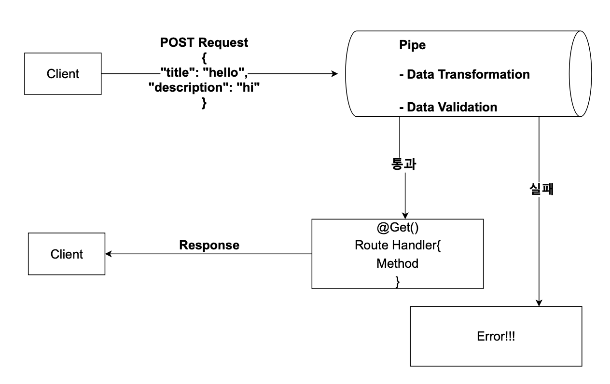

# Pipe

Pipe란

- 파이프는 @Injectable() 데코레이터로 주석이 달린 클래스이다.

- 파이프는 data transformation과 data validation을 위해서 사용된다.

- 파이프는 컨트롤러 경로 처리기에 의해 처리되는 인수에 대해 작동된다.

- Nest는 메소드가 호출되기 직전에 파이프를 삽입하고 파이프는 메소드로 향하는 인수를 수신하고 이에 대해 작동한다.

 

 

*** 

 

## Data Transformation

- 입력 데이터를 원하는 형식으로 변환(예  : 문자열에서 정수로)

- 만약 숫자를 받길 원하는데 문자열 형식으로 온다면 파이프에서 자동으로 숫자로 바꿔준다.

 

***

 

## Data validation

- 입력 데이터를 평가하고 , 유효한 경우 변경되지 않은 상태로 전달하면된다. 그렇지 않으면 데이터가 올바르지 않을 때 예외를 발생시킨다.

- 만약 이름의 길이가 10자 이하여야 하는데 10자 이상 되면 에러를 발생시킨다.

 

    파이프는 위에 두가지 모든 경우에서 라우트 핸들러가 처리하는 인수에 대해서 작동한다.

    파이프는 메소드를 바로 직전에 작동해서 메소드로 향하는 인수에 대해서 변환할 것이 있으면 변환하고 유효성 체크를 위해서도 호출된다.

 

***

 

## PIPE 사용법 

파이프를 사용하는 방법은 세가지로 나눠질 수 있다. 

- Handler-level Pipes
- Parameter-level Pipes
- Global-level Pipes

 

 

## Handler-level Pipes

- 핸들러 레벨에서 @UsePipes() 데코레이터를 이용해서 사용 할 수 있다.

- 이 파이프는 모든 파라미터에 적용된다.

 

***

 

## Parameter-level Pipes

- 파라미터 레벨의 파이프 이기에 특정한 파라미터에게만 적용되는 파이프이다.

 

***

 

## Global Pipes

- 글로벌 파이프로서 애플리케이션 레벨의 파이브 이다.

- 클라이언트에서 들어오는 모든 요청에 적용된다.

- 가장 상단 영역인 main.ts에 넣어준다.

 

 

 

# Built-in Pipes

Nest JS에서 기본적으로 사용할 수 있게 만들어 놓은 6가지의 파이프가 있다.

 

- ValidationPipe
- ParseIntpipe
- ParseBoolPipe
- ParseArrayPipe
- ParseUUIDPipe
- DefaultValuePipe

